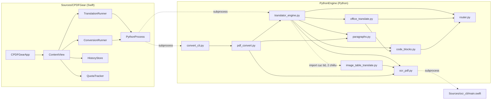

# SKELETON — C-PDF Gear

Cấu trúc dự án + luồng chạy chính. Đọc file này trước để có bức tranh tổng
thể; xem `CODEMAP.md` để tra cứu chi tiết "hàm nào gọi hàm nào".

## Cấu trúc thư mục

```
PDF Tools/
├── Package.swift                          # SPM manifest, 2 executable target
├── Sources/
│   ├── CPDFGear/                          # App SwiftUI chính
│   │   ├── CPDFGearApp.swift              #   entry point, ép foreground
│   │   ├── ContentView.swift              #   toàn bộ UI
│   │   ├── TranslationRunner.swift        #   chạy pipeline dịch theo hàng đợi (subprocess)
│   │   ├── ConversionRunner.swift         #   chạy pipeline xuất Word/PPTX theo hàng đợi
│   │   ├── PythonProcess.swift            #   helper subprocess dùng chung
│   │   ├── QueueItem.swift                #   trạng thái 1 file trong hàng đợi (dùng chung 2 runner)
│   │   ├── HistoryStore.swift             #   lịch sử file đã dịch/xuất (UserDefaults JSON)
│   │   ├── QuotaTracker.swift             #   đọc lại quota DeepL đã dùng (usage_tracker.json)
│   │   ├── KeychainStore.swift            #   lưu/đọc API key qua Keychain macOS
│   │   ├── ApiKeyValidator.swift          #   nút "Kiểm tra key" — gọi thử DeepL/Gemini
│   │   └── UpdateChecker.swift            #   hỏi GitHub Releases xem có bản mới không
│   └── ocr_cli/
│       └── main.swift                     # binary OCR riêng (Vision framework)
└── PythonEngine/                          # engine xử lý PDF/Word/PPTX, chạy qua subprocess
    ├── translator_engine.py               # pipeline DỊCH PDF + entry point chung (main())
    ├── image_table_translate.py           # dịch bảng vẽ dưới dạng ẢNH (screenshot) trong PDF, OCR+dựng lưới
    ├── office_translate.py                # pipeline DỊCH .docx/.pptx (giữ nguyên định dạng)
    ├── pdf_convert.py                     # xuất Word/PPTX từ PDF (độc lập pipeline dịch)
    ├── convert_cli.py                     # CLI wrapper cho pdf_convert.py
    ├── router.py                          # gọi API DeepL/Gemini
    ├── code_blocks.py                     # nhận diện đoạn code, chỉ dịch chú thích bên trong
    ├── paragraphs.py                      # gộp/tách khối chữ thành đoạn văn
    ├── ocr_pdf.py                         # OCR trang scan (gọi ocr_cli)
    ├── .venv/                             # venv riêng cho PythonEngine (gitignored)
    └── test_*.py                          # self-check, chạy trực tiếp
scripts/
└── package_app.sh                         # build .app đóng gói (icon .icns, Info.plist, PythonEngine) + zip
.github/workflows/
├── ci.yml                                 # swift build + self-check PythonEngine mỗi push/PR
└── release.yml                            # build & publish GitHub Release khi push tag v*.*.*
```

Xem [README.md](README.md#packaging--đóng-gói-thành-app) để biết luồng đóng
gói và CI/CD dev → prod (nhánh `dev` → `main` → tag → Release).

## Sơ đồ module (ai import ai / ai gọi ai)



## 3 luồng chính (end-to-end)

- **Dịch PDF/Word/PowerPoint** (hàng đợi nhiều file, nhiều định dạng trộn
  lẫn được): `ContentView` (quản lý `queue: [URL]`) →
  `TranslationRunner.start(inputURLs:)` → xử lý tuần tự từng file bằng
  `processNext()` → `PythonProcess.run()` (subprocess) →
  `translator_engine.py --config` → `main()` → tự nhận diện định dạng theo
  đuôi file: `.pdf` → `process_pdf()` (xóa/vẽ lại từng khối chữ bằng
  redaction — bảng THẬT phát hiện qua `find_tables()` được dịch/vẽ riêng
  theo từng Ô TRƯỚC, tách khỏi pipeline đoạn văn thường bên dưới, vì
  `get_text("dict")` tự đọc sai thứ tự cho bảng nhiều dòng-cao-khác-nhau —
  xem CODEMAP.md mục `build_table_cell_units()`; bảng vẽ dưới dạng ẢNH —
  screenshot dán vào tài liệu, `get_text()` không đọc được gì — cũng được
  OCR + dịch riêng theo Ô qua `image_table_translate.py::
  translate_image_tables()` trước pipeline đoạn văn, xem CODEMAP.md mục
  module đó); `.docx`/`.pptx` → `translate_docx()`/`translate_pptx()`
  (`office_translate.py` — thay trực tiếp text trong run có sẵn, giữ
  nguyên mọi định dạng khác vì không đụng XML nào khác). Cả 2 nhánh gọi
  `translate_units_with_code_awareness()` (`code_blocks.py`) thay vì gọi
  thẳng `router.translate_batch()` — đoạn nào trông giống code (Python/C/
  .../...) chỉ dịch phần CHÚ THÍCH bên trong, phần code giữ nguyên 100%.
  Mỗi file xong gọi `onItemDone` để `ContentView` ghi vào `HistoryStore`.
- **Xuất Word/PPTX** (hàng đợi nhiều file): `ContentView` →
  `ConversionRunner.start(inputURLs:)` → `processNext()` →
  `PythonProcess.run()` (subprocess) → `convert_cli.py --config` → `main()` →
  `convert_to_docx()` / `convert_to_pptx()` (`pdf_convert.py`). Cũng gọi
  `onItemDone` → `HistoryStore`.
- **OCR** (dùng chung bởi cả 2 luồng trên, cho trang scan không có chữ thật):
  `ensure_text_layer()` (`ocr_pdf.py`) → `ocr_page()` → subprocess gọi
  `ocr_cli` (Swift, Vision framework) → chèn lớp chữ ẩn vào PDF.

## Chạy / build

```bash
swift build                    # build app + ocr_cli
swift run CPDFGear             # chạy app
```
Test Python (mỗi file chạy trực tiếp, không cần pytest):
```bash
cd PythonEngine
.venv/bin/python3 test_router.py
.venv/bin/python3 test_paragraphs.py
.venv/bin/python3 test_pdf_convert.py
.venv/bin/python3 test_office_translate.py
.venv/bin/python3 test_ocr_pdf.py   # cần swift build chạy trước (cần ocr_cli)
```
